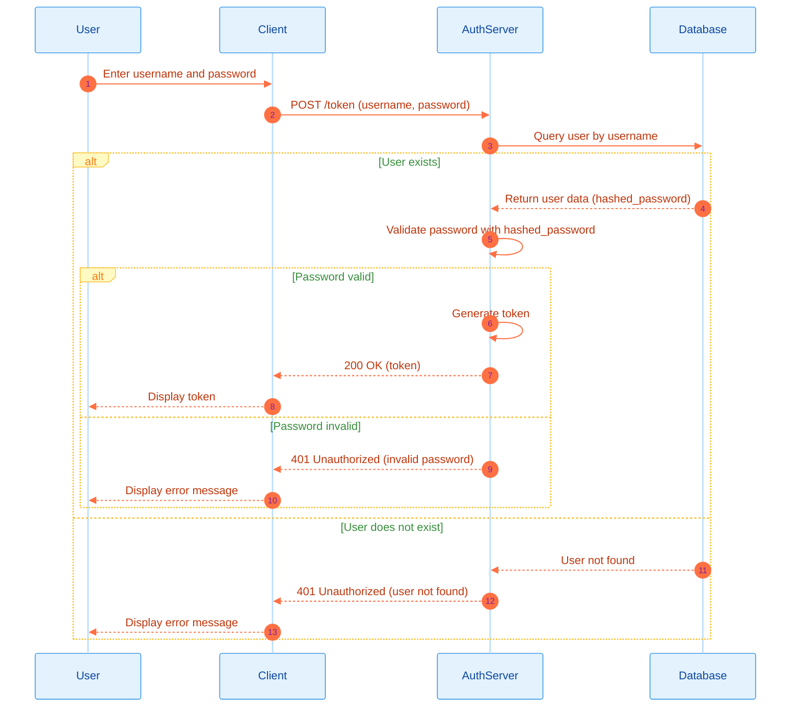

```mermaid
%%{init: {'theme': 'base', 'themeVariables': {
    'actorBkg': '#e3f2fd',
    'actorBorder': '#1e88e5',
    'actorTextColor': '#0D47A1',
    'actorLineColor': '#BBDEFB',
    'signalColor': '#FF7043',
    'signalTextColor': '#BF360C',
    'labelBoxBkgColor': '#FFF9C4',
    'labelBoxBorderColor': '#FBC02D',
    'labelTextColor': '#F57F17',
    'loopTextColor': '#388E3C',
    'activationBorderColor': '#0288D1',
    'activationBkgColor': '#B3E5FC',
    'sequenceNumberColor': '#7B1FA2'
}, 'themeCSS': '.mermaid .loopLine { stroke: #D32F2F; }', 'sequence': {'showSequenceNumbers': true}}}%%

sequenceDiagram
    participant User
    participant Client
    participant AuthServer
    participant Database

    User->>Client: Enter username and password
    Client->>AuthServer: POST /token (username, password)
    AuthServer->>Database: Query user by username
    alt User exists
        Database-->>AuthServer: Return user data (hashed_password)
        AuthServer->>AuthServer: Validate password with hashed_password
        alt Password valid
            AuthServer->>AuthServer: Generate token
            AuthServer-->>Client: 200 OK (token)
            Client-->>User: Display token
        else Password invalid
            AuthServer-->>Client: 401 Unauthorized (invalid password)
            Client-->>User: Display error message
        end
    else User does not exist
        Database-->>AuthServer: User not found
        AuthServer-->>Client: 401 Unauthorized (user not found)
        Client-->>User: Display error message
    end

```
