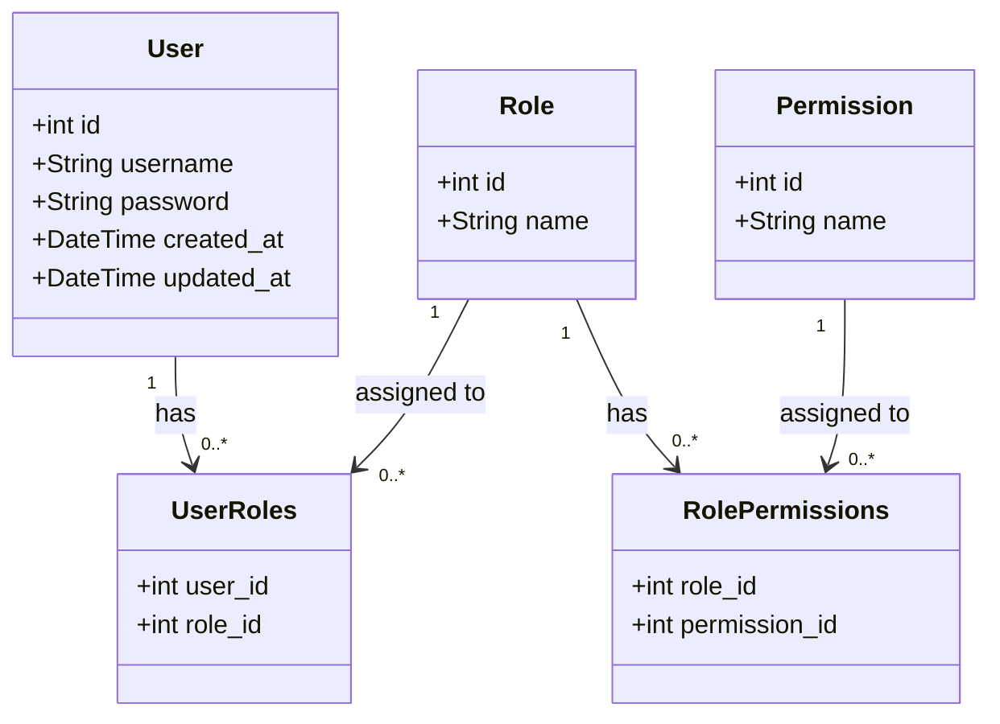

# RBAC

## 用户角色

- `Admin`（管理员）：拥有最高权限，可以管理系统中的所有资源。
- `Moderator`（版主）：可以管理特定资源或用户，通常在社区或论坛中使用。
- `User`（普通用户）：可以访问和使用系统的基本功能。

## 权限

- `READ`（读取权限）：可以查看资源。
- `WRITE`（写入权限）：可以创建或修改资源。
- `DELETE`（删除权限）：可以删除资源。
- `MANAGEUSERS`（用户管理权限）：可以创建、修改或删除用户。
- `MANAGEROLES`（角色管理权限）：可以创建、修改或删除角色。
- `MANAGEPERMISSIONS`（权限管理权限）：可以创建、修改或删除权限。
- `VIEWREPORTS`（查看报告权限）：可以查看系统生成的报告。
- `EDITSETTINGS`（编辑设置权限）：可以修改系统设置。

